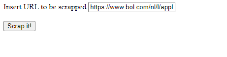
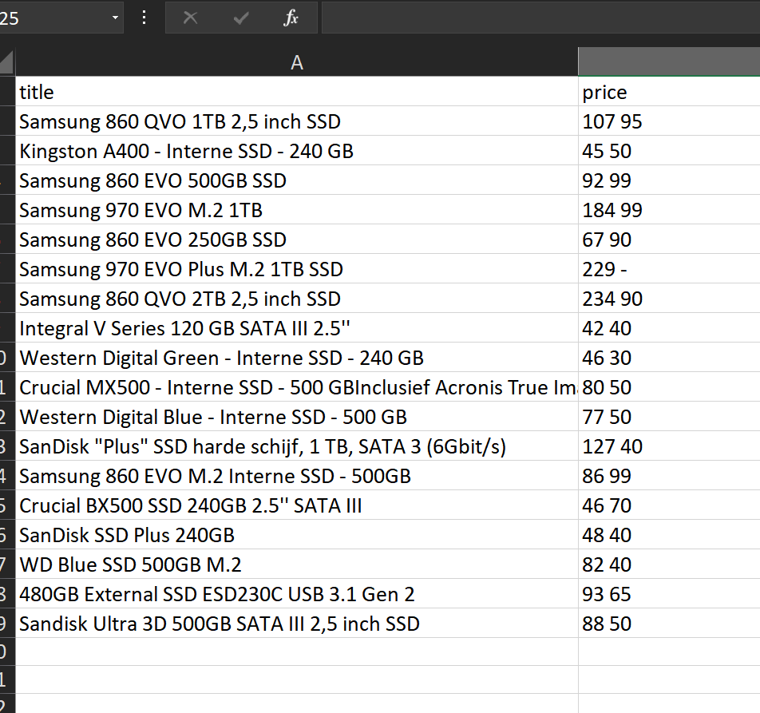

# WebscrapperBolPuntCom

WebscrapperBolPuntCom is a __Node.js__ script together with __Puppeteer__ for scraping the titles and prices of different items on [BolPuntCom](https://www.bol.com/) and putting them into an __Excel__-file.


## Installation

To use the script you'll have to make sure you have Node.js installed
[Install Node.js ](https://nodejs.org/en/download/)

To check if Node.js has successfully been installed, please use
```bash
node --version
```


## Project setup + Launch

Once Node.js has been installed you will need to install the "node modules", this can be done with the following command

```
npm install
```

Please bear in mind, this will also install _Chromium_ which will be used for Puppeteer.
After this, you will need to put your local IP address _(Ipv4 Address)_ into __index.html__ on line 21.
It should look like something like "192.168.x.x" or "10.x.x.x".
#### If you don't know how to find it:
* [Mac OS X](https://osxdaily.com/2010/11/21/find-ip-address-mac/)
* [Windows](https://support.microsoft.com/en-us/help/4026518/windows-10-find-your-ip-address/)


### Launch
Once done you'll need to launch the script with this command.

```
node .\app.js
```

Open the __Index.html__ and insert the URL of the selected items you want to scrap
[Example](https://www.bol.com/nl/l/apple-iphones/N/4010+4294862300/?ruleRedirect=1&sI=Iphone&variants=)


Press on __"Scrap it!"__ to send the data into an Excel file. This should take around 1 minute.

The generated file should be created in the folder of the project.
The confirmation text __"Fini"__ will warn you that everything went successfully and that the Excel-file has been created in the directory.


## Contributing
Pull requests are welcome. For major changes, please open an issue first to discuss what you would like to change.

Please make sure to update tests as appropriate.

## License
[MIT](https://choosealicense.com/licenses/mit/)
